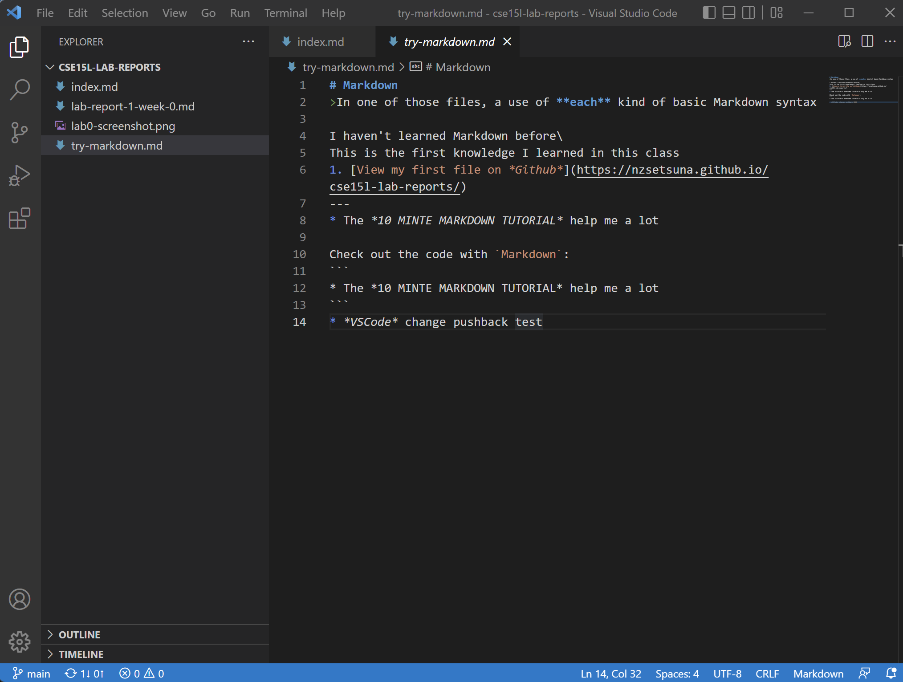
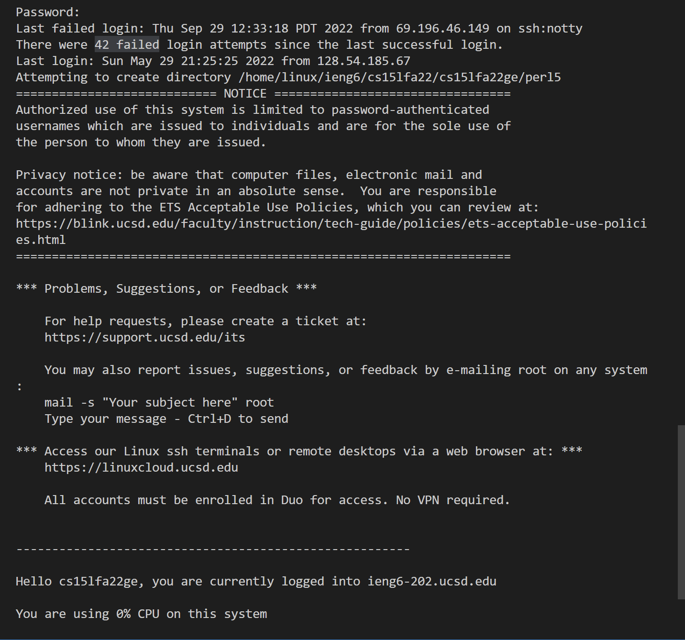
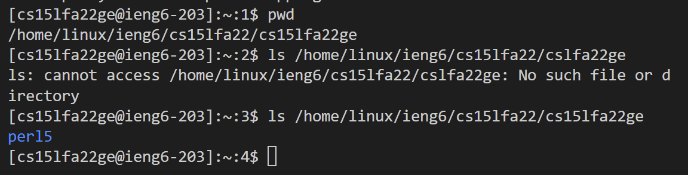
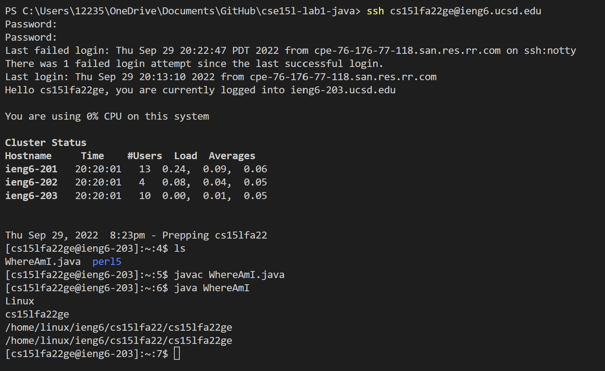
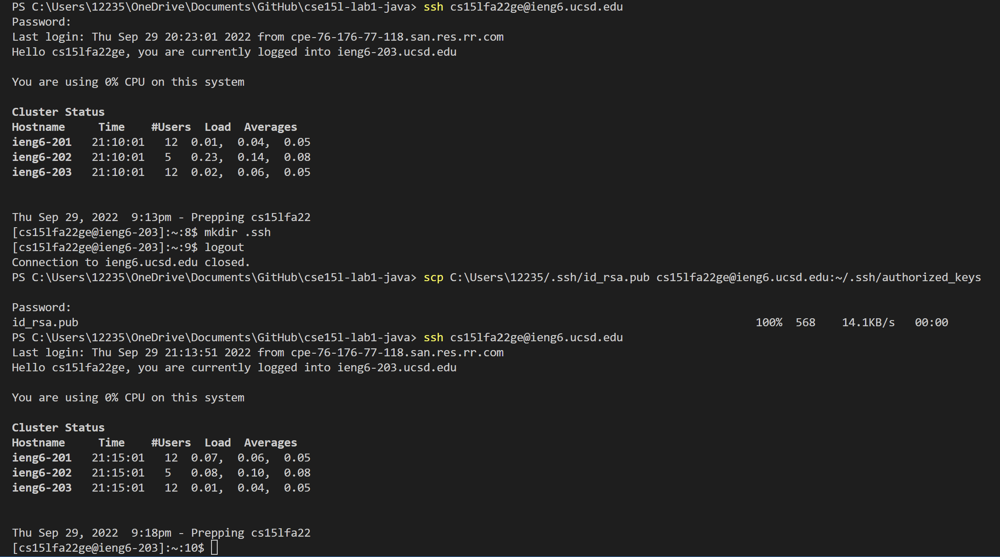
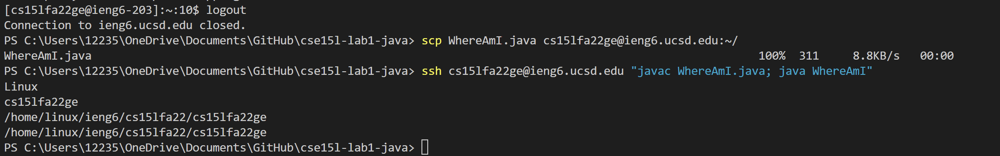

# Week 1 Lab Report
1. **Installing VScode**\
\
 
* I've installed Vscode through the *Visual Studio Code* website [https://code.visualstudio.com/](https://code.visualstudio.com/) before Lab. I haven't had any issues with the previous installs.After opening VScode you should see a window similar to the one in the picture (I have built an md file with VScode).

2. **Romtely Connecting**\
\
 
* In general, you need to enter the ssh command in the terminal in VScode (the ssh command is a way to securely log in from one computer to another). During this step, it took me a while to figure out my account name. This needs to be checked from the UCSD Account Center. Subsequently, you will need to enter your password after the ssh command. Sadly, I changed my password a total of 3 times before the remote server allowed my connection, so it might take some time on the first connection.

3. **Trying Some Commands**\
\

* Running commands on a remote computer feels new to me. I first used the pwd command to display the current directory of the remote server. Then use the ls command to list the folders that exist in the current directory. It should be noted that I entered the wrong file address during the attempt, which resulted in the error. Readers can also try to use the cd command +path to switch directories.

4. **Moving Files with scp**\
\

* I didn't try to run the program locally with Java in this step because I don't have Java installed on my computer. Use the scp command to send the program to the remote server, the process is very similar to the ssh command used for login. The specific operation is to use the scp command + the name of the file you need to copy to the remote server, then add the username followed by: ~/. You will then see the file you want to copy in your home directory in the remote server.
* Run the Java program on the ieng6 computer, and the environment will completely become the configuration environment of the ieng6 computer.

5. **Setting an SSH Key**\
\

* I'm having a good time setting up the SSH keys, but I'm completely unable to do the extra steps in a Windows environment. The specific operation is to use the program ssh-keygen. This file will create the public and private keys. We need to copy the public key to the remote server to replace our access password. The public key should be copied to the user account directory (.ssh/authorized_keys) on the remote server. In my attempts, I found that it is also possible to add the private key to the specified path directly under Windows, without the need to use a specific ssh-add command. After the setup is complete, you should be able to use ssh+username to access the remote server directly like the command in my figure. This greatly reduces the time it takes for me to access the remote server.

6. **Optimizing Remote Running**\
\
 
* Using quotes after the ssh command to run the command directly on the remote server is very convenient.
* I ran it in quotes and semicolons after sending the program to the remote server, and it took only two lines.