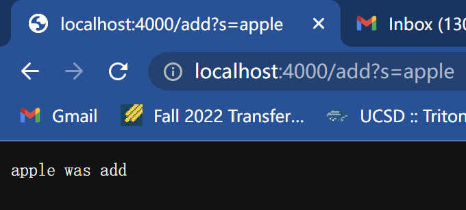
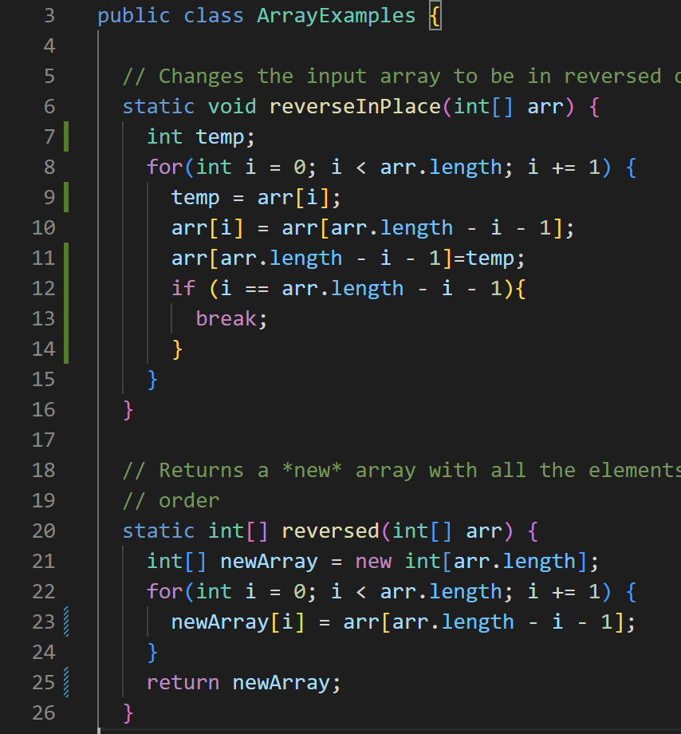

# Week 2 Lab Report
**Part 1**
```
import java.io.IOException;
import java.net.URI;
import java.util.ArrayList;

class Handler implements URLHandler {
    // The one bit of state on the server: a number that will be manipulated by
    // various requests.
    int num = 0;
    int n = 0;
    ArrayList<String> fruit = new ArrayList<String>();
    
    public String handleRequest(URI url) {
        if (url.getPath().equals("/")) {
            return String.format("Number: %d", num);
        } else if (url.getPath().equals("/increment")) {
            num += 1;
            return String.format("Number incremented!");
        } else {
            System.out.println("Path: " + url.getPath());
            if (url.getPath().contains("/add")) {
                String[] parameters = url.getQuery().split("=");
                if (parameters[0].equals("count")) {
                    num += Integer.parseInt(parameters[1]);
                    return String.format("Number increased by %s! It's now %d", parameters[1], num);
                } else if(parameters[0].equals("s")){
                    fruit.add(parameters[1]);
                    n+=1;
                    return String.format("%s was add", fruit.get(n-1));
                }
            } else if(url.getPath().contains("/search")){
                String[] parameters = url.getQuery().split("=");
                ArrayList<String> returnlist = new ArrayList<String>();
                String text="";
                if (parameters[0].equals("s")){
                    for (int i = 0; i < fruit.size(); i++){
                        if(fruit.get(i).contains(parameters[1])){
                            returnlist.add(fruit.get(i));
                        }
                    }
                    for (int i = 0; i < returnlist.size(); i++){
                        text += returnlist.get(i);
                        text += " ";
                    }
                    return text;
                }
            }
            return "404 Not Found!";
        }
    }
}

public class SearchEngine {
    public static void main(String[] args) throws IOException {
        if(args.length == 0){
            System.out.println("Missing port number! Try any number between 1024 to 49151");
            return;
        }

        int port = Integer.parseInt(args[0]);

        Server.start(port, new Handler());
    }
}
```
\

* The `handleRequest` method in the code `Handler` class will be called. The parameter `URI url` should be the server address we actually visit. After that we used a lot of `if` statements and used `.getPath()` to check the `url`. In the current screenshot, the `.url.getPath().contains()` directive detects the path we entered `"/add"`. Then, the code will split the query after the path and create a list `parameters` to store the split string. At this point, `parameters[0]` is equal to `"s"`, and `parameters[1]` is equal to `"apple"`. When `parameters[0]` is equal to `"s"`, `parameters[1]` will be added to the Arraylist `fruit` to store and return a string indicating that `parameters[1]` has been added.


* s


* s

**Part 2**
1. First bug
    * The failure-inducing input:
    
    * The symptom:
    
    * The bug:
    
    * The problem of the reverseInPlace() implementation is it doesn’t create a new array to store the value of the reverse array. According to the output in symptom, we can find that the consequence of this problem is that the first element in the unique array input1 directly becomes the last element in this array. Therefore, when looping to the elements after the median sorting of the array size, the elements before the median sorting have been overwritten by the new elements, and the result is that the elements after the median will not change.