# Week 5 Lab Report
1. **`less`**\
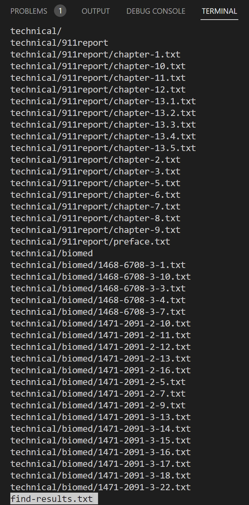\
\
This is the result of the standard `less <<file-path>>` command, which displays the file contents.

    * `-N`
    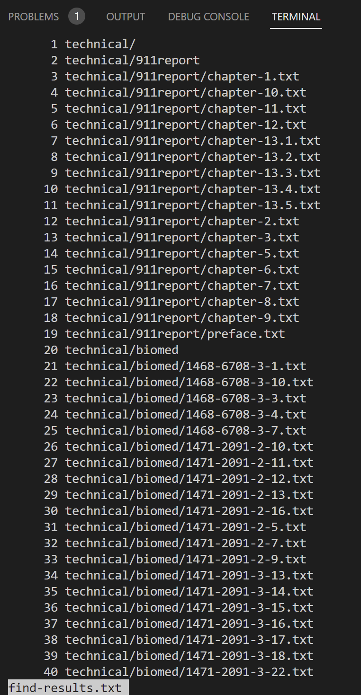\
    \
    The `less -N <<file-path>>` command shows the line numbers of the lines in the file.

    * `-X`
    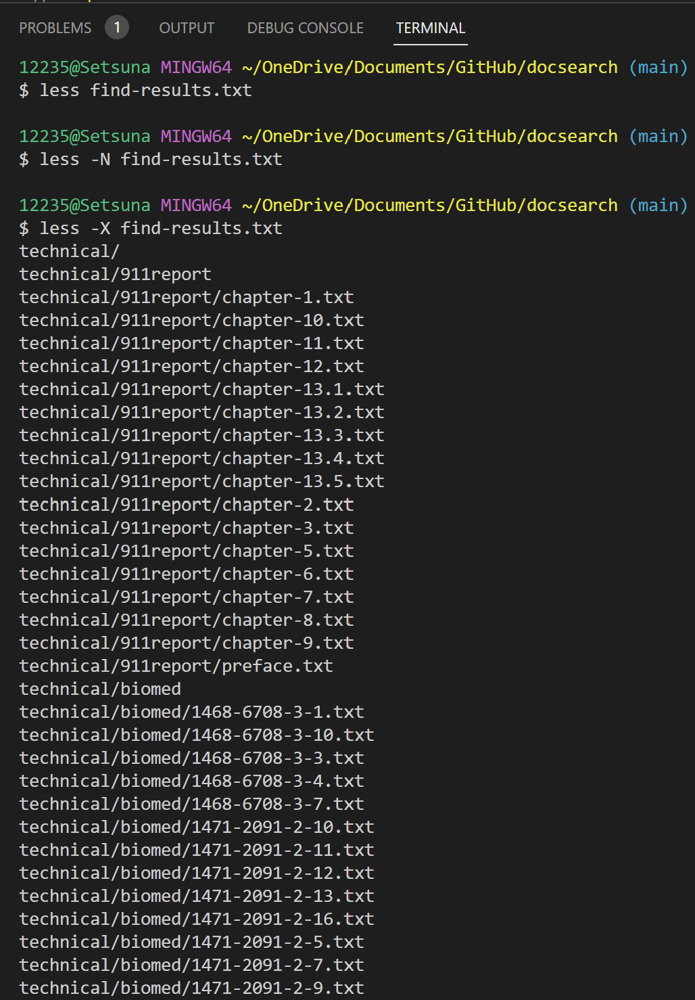\
    \
    The `less -X <<file-path>>` command leaves the contents of the file in Terminal which should be clear on exit.

    * `-M`
    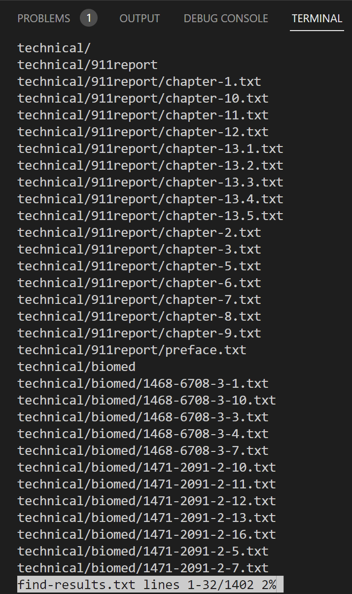\
    \
    The `less -M <<file-path>>` command adds a percentage to the last line of the command line to indicate that what is currently displayed is where the entire content is.

2. **`find`**\
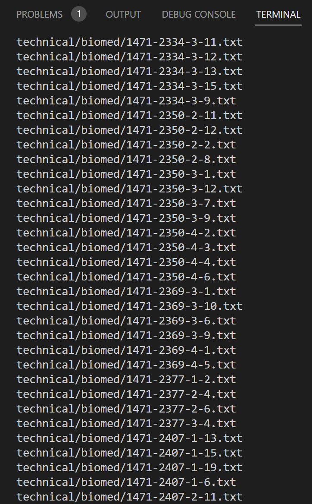\
\
This is the result of the standard `find <<directory-path>>` command, which searches in a directory for files and lists.

    * `-name`
    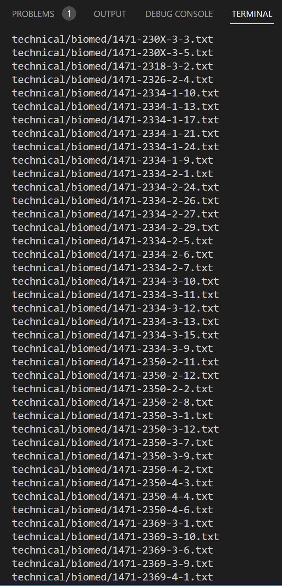\
    \
    The `find <<directory>> -name "pattern"` command returns all filenames in the directory that contain "pattern". It will be very convenient for us to find files of a certain file pattern.

    * `-ls`
    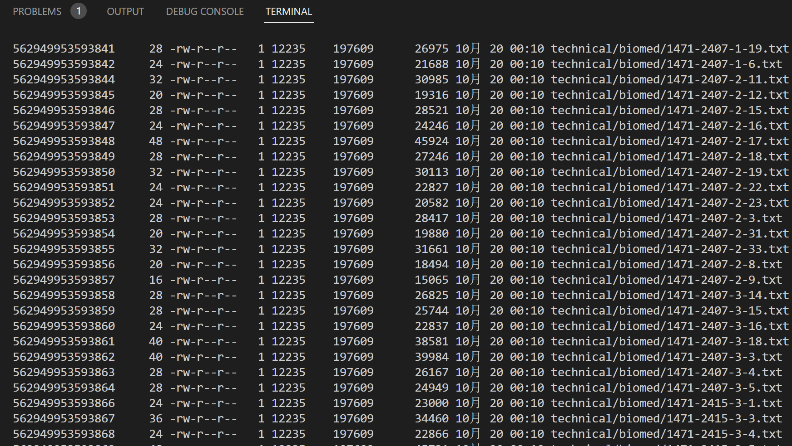\
    \
    The `find <<directory>> -ls` command outputs all file attributes in the directory in ls-dils format. It is useful when we need to see file properties.

    * `>`
    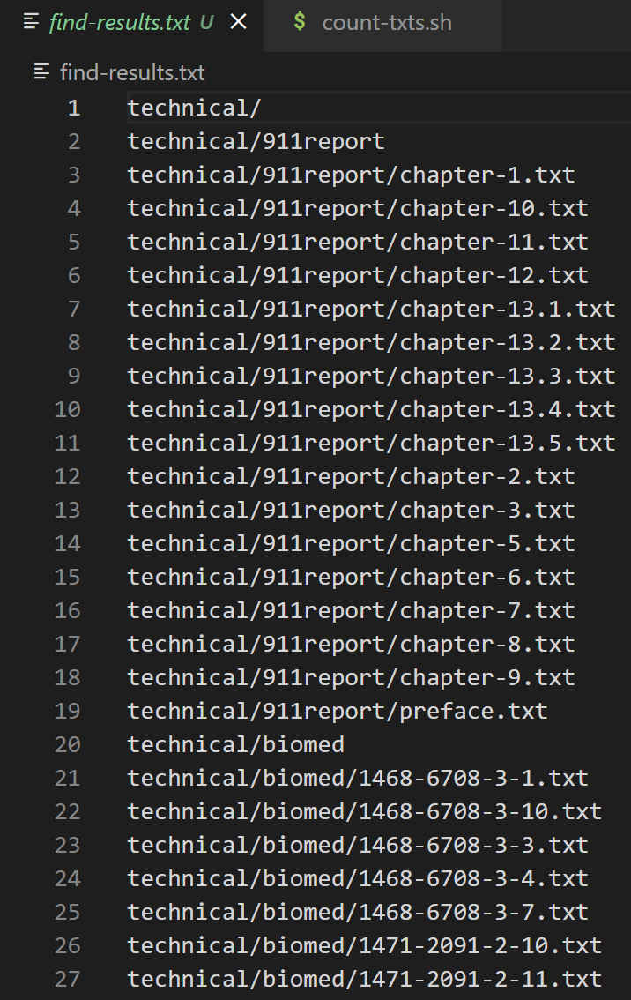\
    \
    This `find <<directory>> > <<file-path>>`  command will import everything returned by the find command into a new file <<file-path>>. After that, we can do more processing on the file.

3. **`grep`**\

    * `-v`
    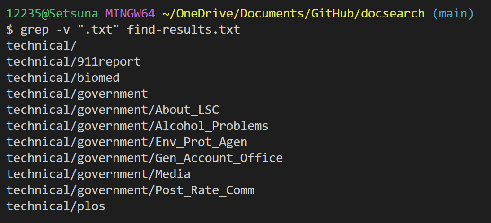\
    \
    The `grep -v` command will return lines that do not match the input. It will work when we need to filter lines.

    * `-c`
    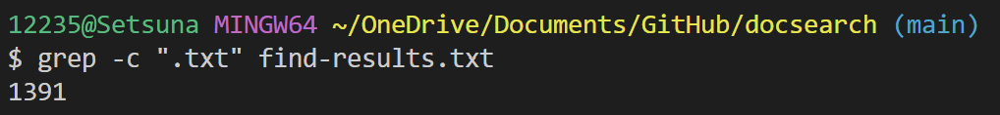\
    \
    The `grep -c` command will count the number of lines in the file that match the input. It will work when we need to know how many lines fit the input.

    * `grep -m num`
    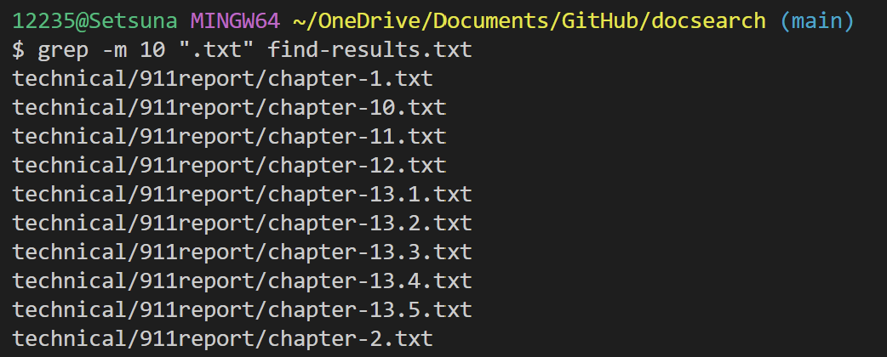\
    \
    This `grep -m NUM` command will output only the first NUM lines matching the input. It will work when we only need a certain number of matching outputs.

