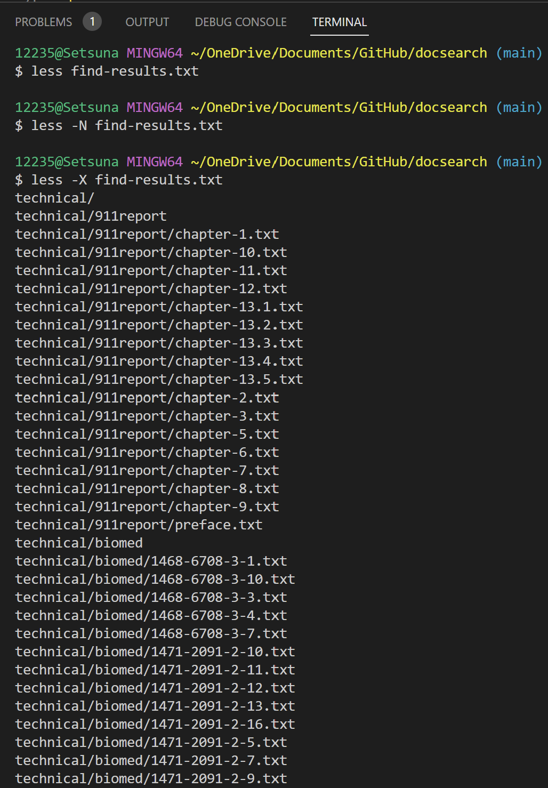
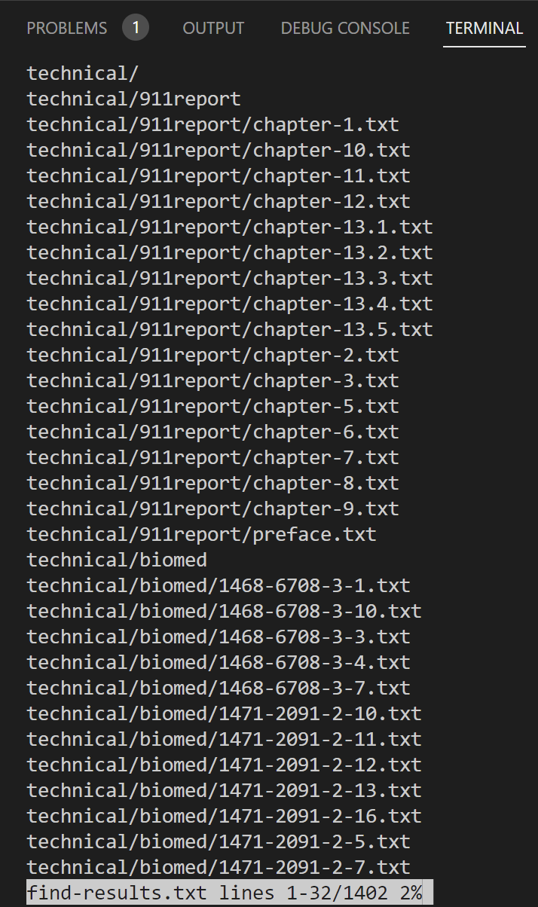
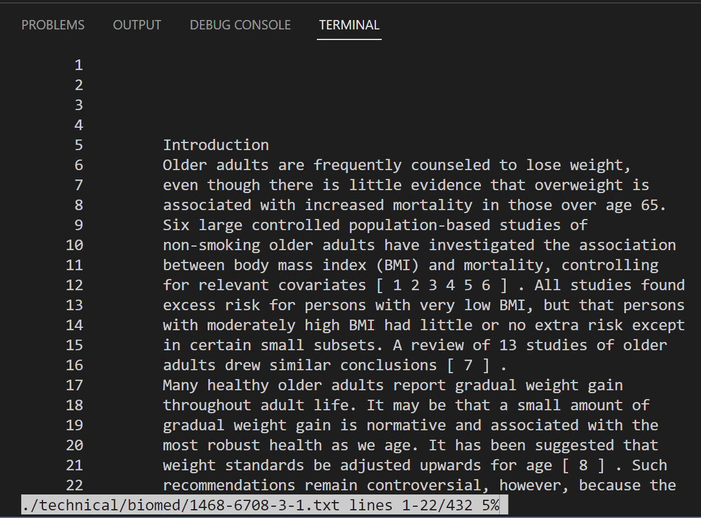
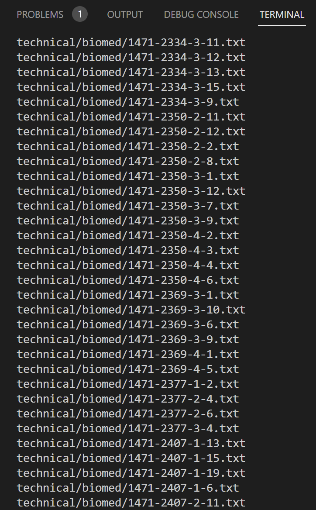
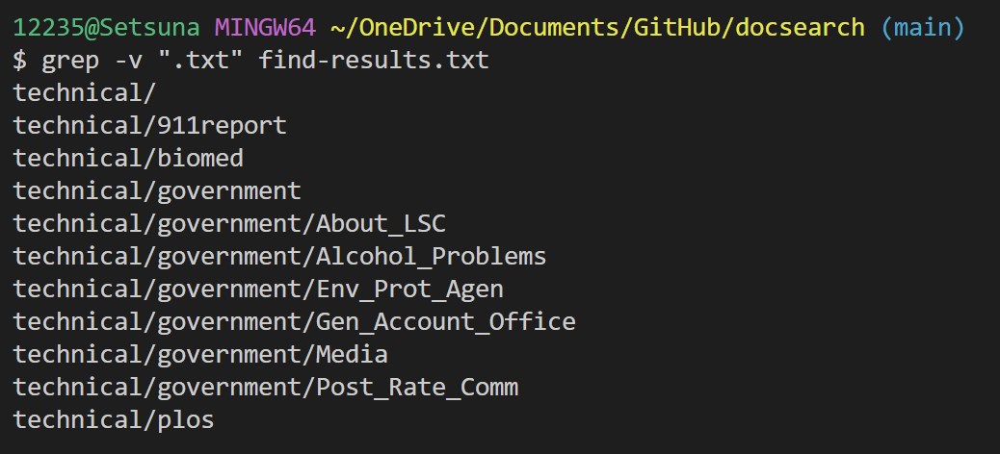
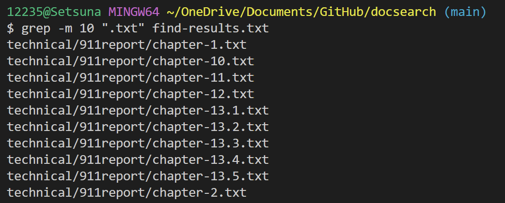

# Week 5 Lab Report
**`less`**\
\
\
This is the result of the standard `less <<file-path>>` command, which displays the file contents.

1. `-N`
    * 

        The `less -N <<file-path>>` command shows the line numbers of the lines in the file.

    * 

        I also found that the -N command can be combined with other command lines, such as -p. In this example, I'm using `less -N -pchapter find-result.txt` to find all items in the .txt file that contain the "chapter" string, and still show the line numbers.

    * 

        Another example, search and line number display for the `./technical/biomed/1468-6708-3-1.txt`file.

2. `-X`
    * 
    
        The `less -X <<file-path>>` command leaves the contents of the file in Terminal which should be clear on exit. This command comes in handy when we need to view content and enter new commands.

    * 

        I tried using `-X` with other commands. In this example I kept the file contents and line numbers in the terminal.

    * 

        I also tried to keep the display of the search command `-p` in the terminal.

3. `-M`
    * 

        The `less -M <<file-path>>` command adds a percentage to the last line of the command line to indicate that what is currently displayed is where the entire content is.

    * 

        I tried using both `-N` and `-M` command line options. I can now clearly compare the information displayed by the `-M` command line. The terminal displayed the contents of lines 1 to 11.

    * 

        Another attempt for the `./technical/biomed/1468-6708-3-1.txt` file.

**`find`**\
\
\
This is the result of the standard `find <<directory-path>>` command, which searches in a directory for files and lists.

1. `-name`
    * 
    
        The `find <<directory>> -name "pattern"` command returns all filenames in the directory that contain "pattern". It will be very convenient for us to find files of a certain file pattern.

2. `-ls`
    * 

        The `find <<directory>> -ls` command outputs all file attributes in the directory in ls-dils format. It is useful when we need to see file properties.

3. `>`

    * 
    
        This `find <<directory>> > <<file-path>>`  command will import everything returned by the find command into a new file <<file-path>>. After that, we can do more processing on the file.

**`grep`**

1. `-v`

    * 

        The `grep -v` command will return lines that do not match the input. It will work when we need to filter lines.

2. `-c`\
    * 
    
        The `grep -c` command will count the number of lines in the file that match the input. It will work when we need to know how many lines fit the input.

3. `grep -m num`\
    * 
    
        This `grep -m NUM` command will output only the first NUM lines matching the input. It will work when we only need a certain number of matching outputs.

