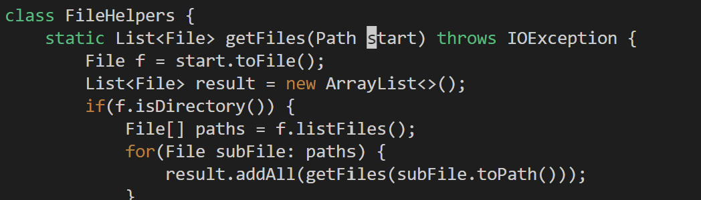
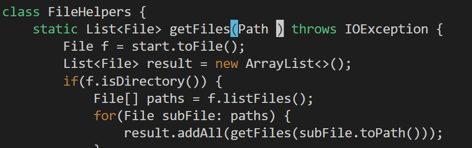
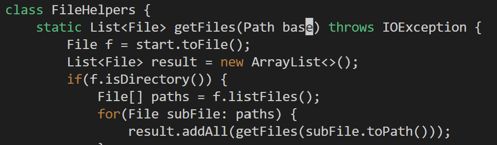
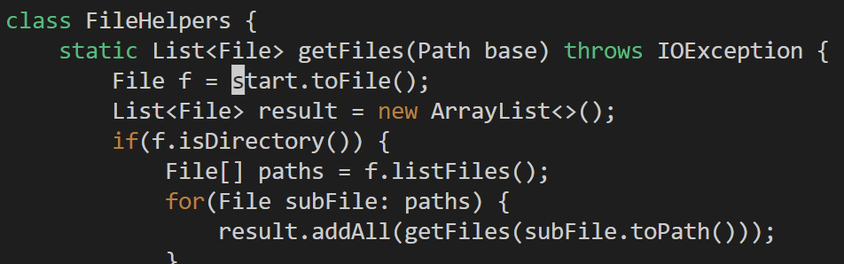
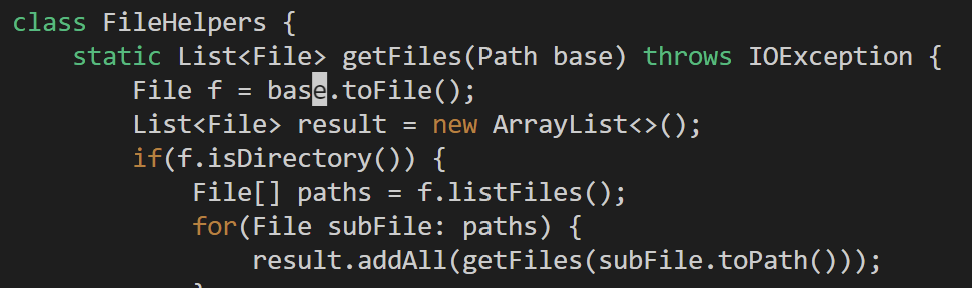
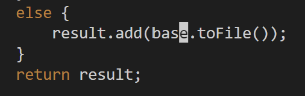
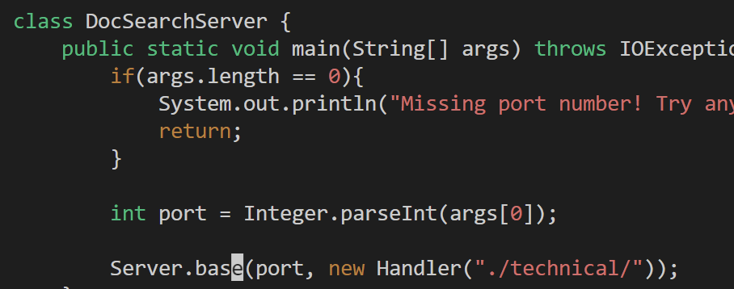
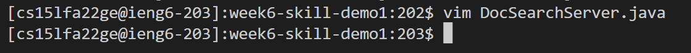

# Week 7 Lab Report
**Part 1**

* Changing the name of the `start` parameter and its uses to `base`
* Every key I pressed: `/start<enter>cwbase<esc>n.n.n.:wq<enter>` (23 in total)
    * **`/start + <enter>`**: Entering `/<word>+<enter>` in normal mode will look for the string named `<word>` in the file content under the cursor, and the cursor will move to the beginning of the string.
    
    * **`cw + base + <esc>`**: Typing `cw` in normal mode deletes all characters from the start of the cursor to the end of the entire string and immediately enters insert mode. After that I entered `base` in insert mode and pressed `<esc>` to exit insert mode.
    
    
    * **`n`**: Entering `n` in normal mode will repeat the action of the previous search. At this point, the system will look for the next possible string `start` again and move the cursor to the beginning of the string.
    
    * **`.`**: Typing a period in normal mode will repeat the entire previous text action. At this point, the `.` command will repeat the full behavior of `cw + base + <esc>`.
    
    * **`n + . + n + .`**: Repeat the first two steps to find the remaining `start` string and change to `base`.
    
    
    * **`:wq + <enter>`**: Typing `:wq` in normal mode will save the file opened by vim and exit vim.
    

**Part 2**

* Edited in VSCode and confirmed it worked: 54 seconds

* Edited in Vim and confirmed it worked: 46 seconds

I think using vim makes it quicker for me to search for words that need to be changed. In addition, editing in vim does not have the step of saving the changed file. I made that mistake the first time I tried editing via VSCode and doubled my time, so I just had to retry it again.

* I would prefer to use vim to edit the content, after all, directly editing the content remotely will save the saving and uploading process after editing locally. I think vim editing is less error prone and faster.

* If I'm creating a project or task from scratch, I still want to be able to edit locally and then upload to a remote server. It's better for me to write tests and debug locally.\
If most of the project has been done remotely or only some files need to be modified, I will choose to use vim. Editing with vim will be more direct and convenient.