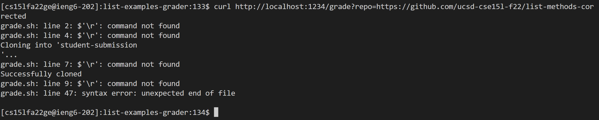
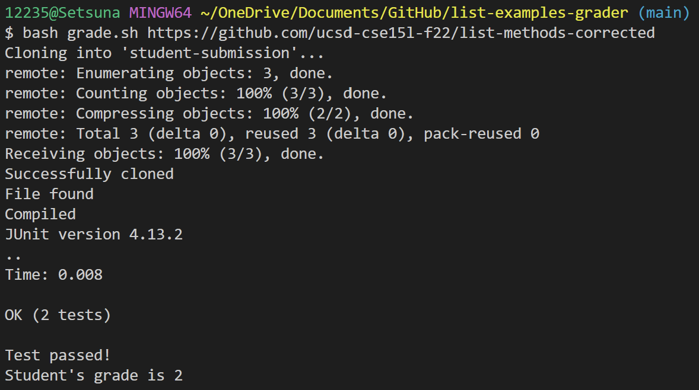
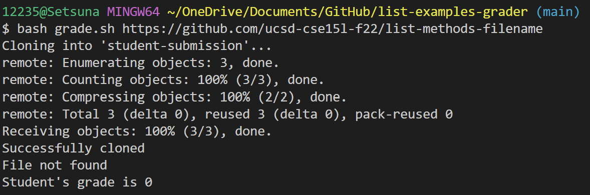
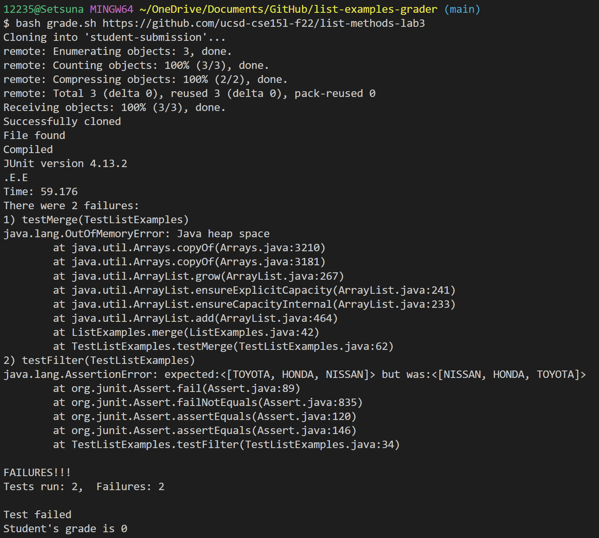

# Week 7 Lab Report

* The code of the `grade.sh`:
    ```
    # Create your grading script here

    # set -e

    rm -rf student-submission
    git clone $1 student-submission

    echo "Successfully cloned"

    cd student-submission
    if [ -f ListExamples.java ]
    then
        echo "File found"
    else
        echo "File not found"
        echo "Student's grade is 0"
        exit 1
    fi

    cd ..
    cp -r lib student-submission/
    cp TestListExamples.java student-submission/
    cd student-submission

    javac -cp .:lib/hamcrest-core-1.3.jar:lib/junit-4.13.2.jar *.java

    if [ $? -eq 00 ]
    then
        echo "Compiled"
    else
        echo "Compilation failed"
        echo "Student's grade is 0"
        exit 1
    fi

    java -cp .:lib/junit-4.13.2.jar:lib/hamcrest-core-1.3.jar org.junit.runner.JUnitCore TestListExamples

    if [ $? -eq 00 ]
    then
        echo "Test passed!"
        echo "Student's grade is 2"
    else
        echo "Test failed"
        echo "Student's grade is 0"
    fi
    ```


* I'm having trouble running a server on a remote server and displaying test information with `curl` commands, below are some screenshots of my attempts.
    


* Below is the result of running it on my local terminal.
    
    
    